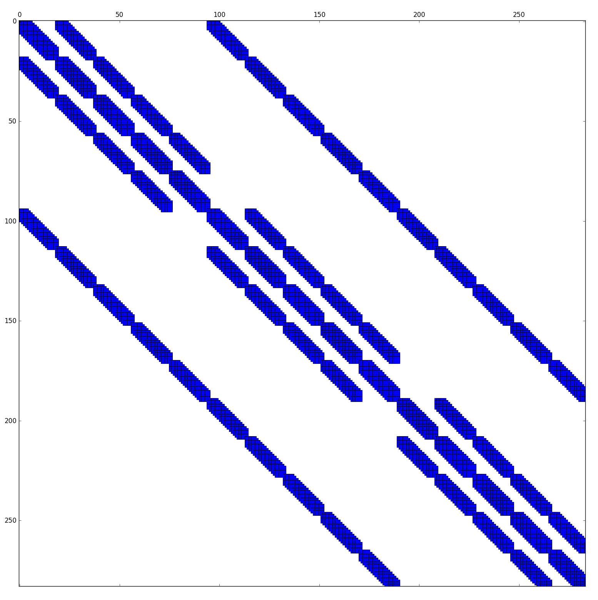

******
Theory
******

.. [Lie2011] Constrainted Timeshift Estimation: https://www.researchgate.net/publication/300121942_Constrained_Timeshift_Estimation

This section is largely based on [Lie2011]_.

.. latex newcommand works across math blocks, so define some useful,
.. much-needed macros
.. math::

    \newcommand{\B}{\mathbf{B}}
    \newcommand{\c}[1]{\mathbf{c}_{#1}}
    \newcommand{\d}{\mathbf{d}}
    \newcommand{\D}{\mathbf{D}}
    \newcommand{\F}{\mathbf{F}}
    \newcommand{\t}{\mathbf{t}}
    \newcommand{\V}{\mathbf{V}}

    \newcommand{\djk}{\mathbf{d}_{j,k}}
    \newcommand{\Fjk}{\mathbf{F}_{j,k}}

Forward problem
===============

Noise free
----------

With the noise-free timelapse poststack data

.. math::

       d_m (t + \frac{1}{2} \Delta t (t))
     = d_b (t - \frac{1}{2} \Delta t (t)) + d_{4D}(t)

where our monitor trace :math:`d_{m}` equals the base trace :math:`d_{b}` by a
varying timeshift :math:`\Delta t` in addition to 4D amplitude changes
:math:`d_{4D}`. By assuming the timeshift is small, we can do a Maclaurin
expansion to first order, reorganise and simplify

.. math::
    :label: noisefree

    d_b(t) - d_m(t)
    \approx
    \frac{1}{2} \partial_{t} (d_{b}(t) + d_{m}(t)) \Delta t(t) + d_{4D}(t)

where half the timeshift :math:`\Delta t` is used on both base- and monitor
surveys. We can rewrite this in matrix notation

.. math::

    \Delta \d
    \approx
    \frac{1}{2} \D \Delta \t + \d_{4D}

where :math:`\Delta \d` is the raw, element-wise difference between a pair of
traces (results in a vector), and :math:`\D` is a diagonal matrix containing
the element-wise sum of the derived vectors of the base and monitor traces.
When these equations are assembled for the combinations of vintages, that's the
whole problem when it comes to physics.

.. note::

    Timeshifts :math:`\mathbf{\Delta t}` can be seen either as a shift from base
    to monitor as we do in this solution or as a shift from monitor to base. One
    is simpli a negation of the other.

With noise
----------

However, the *seismic observations* are naturally noisy, and noise terms
:math:`\epsilon` must be introduced in the equations:

.. math::

    d_b(t) - d_m(t)
    & \approx
      \frac{1}{2} \partial_t (d_b(t) + d_m(t)) \Delta t_0(t)
      + d_{4D}(t) \\
    & + \frac{1}{2} \partial_t (\epsilon_b(t) + \epsilon_m(t)) \Delta t_0(t)
      + \epsilon_b(t) - \epsilon_m(t)

Written in matrix notation as

.. math::

    \Delta \d
    &= \frac{1}{2} (\D + \mathbf{\Lambda}) \Delta t_0 + \epsilon \\
    &= \frac{1}{2} \F \Delta t_0 + \epsilon

where :math:`\mathbf{\Lambda}` is the diagonal matrix containing the
element-wise sum of the derivative of the noise vectors.

The observed signal contains the data vectors as well as the noise, thus, the
operator :math:`\mathbf{F}` is computed as the average of the derivatives of
the base- and monitor traces. Likewise, the element-wise difference of these
traces will yield :math:`\Delta \d - \epsilon`.

Inverse problem
===============

Basis functions
---------------

The forward problem becomes *very large* [#f1]_ very quickly, and is
impractical to solve for any reasonable problem sizes. It as have lower
vertical resolution than the sampled grid, so in order to reduce the problem
size (matrix size), the problem is reformulated in terms of basis functions.

.. math::

    \Delta t(t) = \sum_i b_i(t) c_i

where :math:`b` is a basis function, and :math:`c` is a corresponding
coefficient. In matrix notation, using discrete basis functions as columns,
this can be written as

.. math::

    \Delta t(t) = \B \mathbf{c}

where :math:`\B` are the basis functions on matrix form, and :math:`\mathbf{c}`
is a vector of coefficients. A B-spline is used to form the basis.

On density
~~~~~~~~~~

The density of the basis functions, or the number of columns in :math:`\B`,
controls the level of (vertical) details that can resolved.  A higher density
increases the number of unknowns, which increases computational cost and
increases the probability of noise related artefacts.

Operator
--------

:Assumption: Timeshift is due to changes in the underground
:Assumption: 4D amplitude effect is a normally distributed error term

The following reasoning is based on the assumption that the time lapse
timeshift is due to velocity changes in the underground. This is not always
true, but the derived constraints will still be sensible, although the
derivation might be dubious. The chosen approach is that we regard
:eq:`noisefree` as the forward model, an d solve it as a Bayesian inverse
problem. In order to formulate the likelihood a second assumption is stated:
that that we can assert the 4D-amplitude effect prior to inversion, and that we
can formulate it as an error term :math:`\mathcal{N}`

.. math::

    d_{4D} \sim \mathcal{N}(0, \sigma_{4D}(j,k,t))

where :math:`j` and :math:`k` are the in- and crossline respectively. That
means we can define a weight function that indicates higher probability some
places in the data volume. If we assume Gaussian noise, we get the likelihood

.. math::

    \DeclareMathOperator{\diag}{diag}
    L &= \exp[
            (\F \Delta \t - \Delta \d)^T
            C^{-1}_{4D + \epsilon}
            (\F \Delta \t - \Delta \d)
        ]

    C_{4D + \epsilon} &=
        \diag
        (\sigma_{4D}(t) +
        \sigma_{\epsilon_b}(t) - \sigma_{\epsilon_m}(t))

This assumption means the problem can be solved with a least-square approach.

Constraints
-----------

Lateral smoothing
~~~~~~~~~~~~~~~~~

:Assumption: Timeshifts are laterally consistent

Mathematically, this assumption ca be stated as

.. math::

    \B \c{j,k} - \frac{1}{4}(
        \c{j-1,k} +
        \c{j+1,k} +
        \c{j,k-1} +
        \c{j,k+1} )
    \sim
    \mathcal{N}(0, \sigma_{NN})

where :math:`\sigma_{NN}` are the constraints on the nearest neighbours. This
means that the difference between the timeshift at a central trace
:math:`(j,k)` and the mean of its four neighbours is normally distributed with
mean :math:`0` and some given variance :math:`\sigma_{NN}`.

There is no statistical reasoning for the choicse of normal distribution, but
it has some appealing features. First of all, the resulting optimisation
problem is linear which both implies a unique, and easy to find minimum.
Secondly, the constraint is global, which means that we control the smoothness
of the total result (through a linked system), but still allow for local
discontinuities, since a discontinuity in one of these links will not have a
big impact on the full cost function.

Vertical smoothing
~~~~~~~~~~~~~~~~~~

:Assumption: Timeshifts are vertically smooth

This is a safe assumption since even a discontinuous velocity change will give
a continuous timeshift. Since we want our timeshifts to be smooth, we can claim
that the derivative of timeshifts should be small. Correspondingly, we could
claim that we wanted to have as few velocity changes as possible (sparseness
argument - we do not have velocity changes everywhere). Thus our prioer model
is that relative velocity changes are zero everywhere, but with a variance that
allows for the needed velocity changes to explain our data. This ends up in the
same constraint

.. math::

    \V \B \c{j,k} \sim \mathcal{N}(0, \sigma_{v})

where

.. math::

    \V = \begin{pmatrix}
            1      &  -1    &  0     & 0      & \cdots &  0     \\
            0      &   1    & -1     & 0      & \cdots &  0     \\
            \vdots & \ddots & \ddots & \ddots & \ddots & \vdots \\
            \vdots & \ddots & \ddots & \ddots & \ddots & \vdots \\
            0      &   0    & \cdots & \cdots &  1     & -1     \\
         \end{pmatrix}

:math:`\V`, when multiplied with :math:`\B \mathbf{c}`, represents the level of
vertical smoothness, and is used to prefer solutions with minimal difference
between consecutive timeshift values.

.. note::

    Both the choice of basis function density (resolution), and vertical
    smothing, influence the solution in a similary way, but in opposite
    directions: both low density basis functions and strong vertical smoothing
    provide smooth solutions.

Linear system
-------------

Putting the constraints and operator together yields the equation

.. math::
    :label: linear-sys

    [
          (\Fjk \B)^T \frac{1}{\sigma_{\epsilon}} (\Fjk \B)
        + \B^T \frac{1}{\sigma_{NN}} \B
        + \B^T \V^T \frac{1}{\sigma_{v}} \V \B
    ] \c{j,k} \\
    =
          (\Fjk \B)^T \frac{1}{\sigma_{\epsilon}} \Delta \djk
        + \B^T \frac{1}{4 \sigma_{NN}} \B
          (\c{j-1,k} + \c{j+1,k} + \c{j,k-1} + \c{j,k+1})

where j and k denote inline and crossline numbers, respectively.  The solution
is non-local due to the nearest neightbour term (from lateral smoothing), but
is a linear sparse system and is general and easy to solve.

This equation can be broken down into its respective parts:

    1. The inverse operator :eq:`inverse-operator`
    2. The central component of horizontal smoothing
       :eq:`central-lateral-smoothing`
    3. Vertical smoothing :eq:`vertical-smoothing`
    4. The solution vector :eq:`solution-vector`
    5. The non-central component of horizontal smoothing
       :eq:`non-central-lateral-smoothing`

.. math::
    :label: inverse-operator

    (\Fjk \B)^T \frac{1}{\sigma_{\epsilon}} (\Fjk \B)

.. math::
    :label: central-lateral-smoothing

    \B^T \frac{1}{\sigma_{NN}} \B

.. math::
    :label: vertical-smoothing

    \B^T \V^T \frac{1}{\sigma_{v}} \V \B

.. math::
    :label: solution-vector

    (\F \B)^T \frac{1}{\sigma_{\epsilon}} \Delta \djk

.. math::
    :label: non-central-lateral-smoothing

    \B^T
    \frac{1}{4 \sigma_{NN}} \B
    (\c{j-1,k} + \c{j+1,k} + \c{j,k-1} + \c{j,k+1})

The system :eq:`linear-sys` can be set up for a pair of vintages in terms of a
vector

.. math::

    \mathbf{c} = \begin{pmatrix}
                    \c{0,0}          \\
                    \c{0,1}          \\
                    \vdots           \\
                    \c{1,0}          \\
                    \c{1,1}          \\
                    \vdots           \\
                    \c{j,k}          \\
                 \end{pmatrix}

and a matrix with left-hand side of the equation placed along the diagonal and
the nearest neighbour terms distributed as off diagonal entries. The sparsity
pattern of the resulting matrix for a small example is shown in the figure
`sparsity pattern`_.

.. _`sparsity pattern`:

    Sparsity pattern of the linear system formed by a pair of vintages

As we can see from the figure, the system consists of a narrow diagonal band
with some off diagonal entries resulting from the lateral smoothing. Thus, if
we remove the non-central components of the lateral smoothing we are left with
a matrix with a narrow diagonal band. Furthermore, the system becomes
symmetric. This allows for storing the system in a very efficient way, by
saving only the right-hand-side diagonals.

The lateral smoothing matrices are independent of trace and therefore only need
to be computed once.

Data scaling
============

The scaling of the system :eq:`linear-sys` is important. If we add the
constraint operator, :math:`\mathbf{\Gamma}`, and if the data were scaled by a
constant :math:`\gamma`, we would get

.. math::

    (\gamma \F^T) \Delta (\gamma \d)
    = (\gamma \F^T) (\gamma \F)
      \Delta \t + \mathbf{\Gamma}

as the operator :math:`\mathbf{F}` is proportional to the data
:math:`\mathbf{d}`. Dividing by :math:`\gamma^{2}` gives

.. math::

      \F^T \Delta \d
    = \F^T \F \Delta \t
    + \frac{\mathbf{\Gamma}}{\gamma^2}

This shows that the scaling of the data influences the strength of the
regularisation :math:`\mathbf{\Gamma}`. Bearing in mind that seismic may be
scaled arbitrarily, an automatic scaling is necessary to keep comparable
constraints. It is assumed all inputs are uniformly scaled.

4D correction
=============

To account for the effects of the timeshift on the noise we set

.. math:: \Delta t = \Delta t_0 + \Delta t_c

where :math:`\Delta t_c` is a correction factor. We would like

.. math::

    \Delta \d = \D \Delta t + \epsilon
              = \D (\Delta t_0 + t_c) + \epsilon

leading to

.. math:: \Delta d - \D \Delta t_0 = \D \Delta t_c + \epsilon

If we assume the operator :math:`\F = (\D + \mathbf{\Lambda})` to be
sufficiently close to the operator :math:`\D`, we can approximate this:

.. math:: \Delta \d - \F \Delta t_0 = \F \Delta t_c + \epsilon

:math:`\Delta t_0` is estimated by solving the linear system from
:eq:`linear-sys`, and the correction is later estimated with this equation. In
practice, this means adding a correction term and running a few iterations of a
linear solver.

Multi-vintage handling
======================

For the difference between two vintages :math:`p` and :math:`q`, we have

.. math:: \Delta \d_{p,q} = \F_{p,q} \Delta t_p + \epsilon

For more than two vintages, in this example 3, we have the system

.. math::

    \begin{pmatrix}
        \F_{1,2} & 0        & 0         \\
        0        & \F_{2,3} & 0         \\
        0        & 0        & \F_{1,3}  \\
    \end{pmatrix}
    \begin{pmatrix}
        \Delta \t_1 \\
        \Delta \t_2 \\
        \Delta \t_3 \\
    \end{pmatrix}
    =
    \begin{pmatrix}
        \Delta \d_{1,2} \\
        \Delta \d_{2,3} \\
        \Delta \d_{1,3} \\
    \end{pmatrix}

These sub systems are not independent, and in particular we have that
:math:`\Delta t_3 = \Delta t_1 + \Delta t_2`, meaning we can simplify the system.

.. math::

    \begin{pmatrix}
        \F_{1,2} & 0        \\
        0        & \F_{2,3} \\
        \F_{1,3} & \F_{1,3} \\
    \end{pmatrix}
    \begin{pmatrix}
        \Delta \t_1 \\
        \Delta \t_2 \\
    \end{pmatrix}
    =
    \begin{pmatrix}
        \Delta \d_{1,2} \\
        \Delta \d_{2,3} \\
        \Delta \d_{1,3} \\
    \end{pmatrix}

This new system is over-determined with one degree of freedom less. It still
keeps the general structure of the system, so while it does not preserve the
same constraints, they are sufficiently close to those of the two-vintage case.
This system is *very* sparse.

.. rubric:: Footnotes

.. [#f1] Three 400MB surveys yields a system of n million variables
